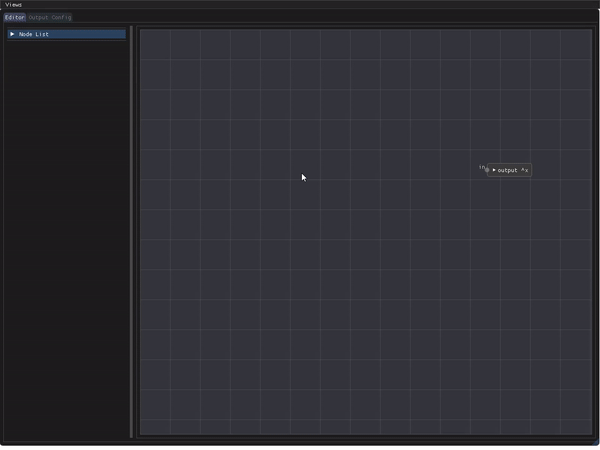

# Map Generator
[](https://ci.appveyor.com/project/nnarain/mapgen2/branch/master)

A prototyping tool for 2D and 3D procedural terrain maps.

Build
-----

Requirements:

 * [Magnum](http://magnum.graphics/)
 * SDL2
 * Boost

I am managing the above with `vcpkg`, however that is not required as long as `cmake` can find them.

For `vcpkg`:

```bash
$ vcpkg install boost-variant
$ vcpkg install corrade --head
$ vcpkg install magnum --head
```

Configure and build:

```bash
$ cd /path/to/mapgen2
$ mkdir build && cd build
$ cmake .. -DCMAKE_TOOLCHAIN_FILE=/path/to/vcpkg.cmake
$ cmake --build . --target mapgen2
```

Ommit `CMAKE_TOOLCHAIN_FILE` if not using `vcpkg`. Set necessary `Boost` options (e.g. `-DBoost_USE_STATIC_LIBS=OFF`).


Usage
-----

Add and connect nodes in the editor to create a noise output.




